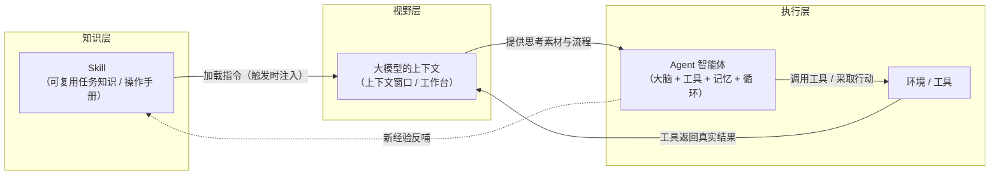

# 概念关系说明：Agent、上下文 与 Skill

> 本文说明三个概念之间的关系，重点回答两个问题：
> 1. **上下文如何影响 Agent 的工作？**
> 2. **Skill 如何沉淀可复用的任务知识？**

---

## 一、一句话关系

> **Skill 是"沉淀下来的可复用知识/操作手册"；上下文是 Agent 的"工作台/视野"；Agent 是在这个工作台上、按照手册去行动的执行者。**

三者构成一个循环：Skill（知识）→ 被加载进上下文（视野）→ 指导 Agent 行动（执行）→ Agent 的行动结果与工具返回又写回上下文 → 新经验再沉淀成更好的 Skill。

---

## 二、关系图（Mermaid）

**图读法：**

1. **Skill → 上下文**：Skill 被触发后，其指令正文被"注入"进上下文，成为 Agent 能"看到"的流程知识。
2. **上下文 → Agent**：上下文是 Agent 思考、规划、决策的全部依据；上下文里有什么，Agent 才知道什么。
3. **Agent → 环境/工具**：Agent 在上下文内决定行动，然后调用工具执行。
4. **环境 → 上下文**：工具返回的"真实结果"（ground truth）写回上下文，供 Agent 判断进度、纠错。
5. **Agent → Skill**（虚线）：在实践中发现更好的做法时，可以回头改进 Skill，完成知识沉淀。

---

## 三、三者对比表

| 维度 | Agent（智能体） | 上下文（Context） | Skill（技能） |
| --- | --- | --- | --- |
| 本质 | 能自主行动的 AI 系统 | 模型单次"看得见"的文字范围 | 打包成文件的可复用任务手册 |
| 角色比喻 | 实习生（会动手做事） | 工作台 / 草稿纸 | 操作手册 / 入职指南 |
| 关键组成 | 大脑、工具、记忆、循环、环境反馈 | 系统提示、历史、资料、工具返回 | 元数据、指令正文、可选资源 |
| 生命周期 | 一次任务的执行过程 | 一次请求的瞬时窗口 | 可长期沉淀、版本管理、跨项目复用 |
| 典型问题/边界 | 自主性带来的成本与错误复利 | 窗口满了会"遗忘"旧内容 | 手册过时/写糊会影响执行质量 |

---

## 四、上下文如何影响 Agent 的工作

上下文是 Agent 的**唯一工作视野**，它从三个层面直接决定了 Agent 的表现：

1. **能做什么**：Agent 能用哪些工具、遵循哪些规则、掌握哪些背景信息，全由上下文里的系统提示与工具定义决定。
2. **做得多好**：上下文窗口有限，关键信息若被"挤出窗口"或"埋在长文本中间"，Agent 就可能漏掉重要约束、基于不完整信息行动，甚至产生幻觉。
3. **能自我纠错**：工具返回的真实结果要写回上下文，Agent 才能"看到"上次行动的效果并调整下一步。没有这步"环境反馈进上下文"，Agent 就会在黑暗中瞎转。

> **个人理解：** 可以把 Agent 想成一个"只有工作台、没有长期记忆的实习生"。工作台（上下文）上摆什么，它就按什么来干活；摆错了、摆漏了，活就会干砸。所以"管理上下文"（该放什么、放多少、怎么检索）是让 Agent 稳定工作的关键。

---

## 五、Skill 如何沉淀可复用的任务知识

Skill 解决的是"每次都要重新交代一遍"的重复劳动，它把知识**从"对话"里搬到"文件"里**：

1. **把流程固定下来**：把"某类任务怎么做"（适用场景、输入、步骤、输出结构、自检要求）写成 `SKILL.md`，不再依赖临场发挥。
2. **按需加载，不占上下文**：靠 `description` 匹配触发，用到才把正文加载进上下文（"渐进式披露"），避免常驻占用窗口。
3. **可版本管理、可共享**：因为它是文件，可以放进 Git，随仓库传播给团队，也能持续迭代改进。

> **个人理解：** Skill 本质上是把"人的经验"外化成"机器的流程"。它不改变模型的智力，但通过把"怎么做"写清楚，让 AI 在特定任务上更稳、更一致、可复现——这也是本作业选择"概念学习资料生成"做成一个 Skill 的原因。

---

## 六、小结（三者如何协同）

一个完整的 AI 工作循环可以这样串起来：

1. 用户提出任务，系统根据 Skill 的 `description` 判断需要加载哪个 Skill；
2. Skill 的指令被注入到**上下文**；
3. **Agent** 在上下文的指导下，规划并调用工具行动；
4. 工具结果写回上下文，Agent 据此迭代，直到完成；
5. 过程中发现更好的做法，就回头改进 **Skill**，让下次更省力、更准确。

> 所以：**Skill 决定"会不会做"，上下文决定"此刻看得到多少"，Agent 负责"真正动手做完"。** 三者缺一不可。
